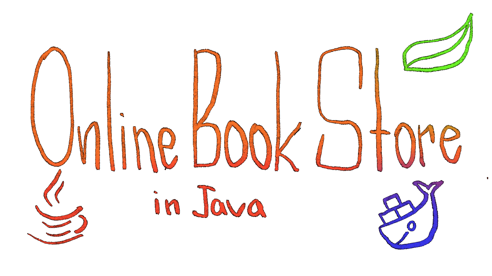

# BookNest Project API

## Introduction

Welcome to the Online Book Store API project, a robust solution built using Spring Boot. This platform aims to provide an efficient and user-friendly experience for managing an online bookstore, catering to both customers and administrators.

## Inspiration

The inspiration for this project was the growing demand for online stores and the need for a reliable platform to effectively manage inventory, customer orders, and overall store functionality.

## Technologies Used

- **Spring Boot (v3.2.1):** A powerful framework for building Java-based enterprise applications.
- **Spring Security:** Ensures application security with features such as authentication and authorization.
- **Spring Data JPA:** Simplifies the data access layer, facilitating interactions with the database.
- **Swagger (springdoc-openapi):** Enables comprehensive API documentation, easing developer understanding and interaction.
- **Liquibase:** Manages database schema changes and version control.
- **MapStruct (v1.5.5.Final):** Simplifies the implementation of mappings between Java bean types.
- **JWT (JSON Web Token):** Ensures secure user authentication.
- **Docker:** Containerizes the application for consistent and portable deployment.
- **Lombok:** Reduces boilerplate code through annotations, enhancing developer productivity.
- **Hibernate (v6.4.1.Final):** A robust ORM framework that simplifies database interactions.
- **MySQL (v8.0.33):** A reliable and scalable relational database management system.
- **Java (version 17):** The programming language and platform for building and running the application.

## Key Features

- **User Authentication:** Secure user authentication using JWT for enhanced security.
- **Database Migration:** Leveraging Liquibase for smooth database schema updates.
- **API Documentation:** Utilizing Swagger to generate clear and interactive API documentation.
- **Data Validation:** Incorporating Spring Boot's validation and Hibernate Validator to ensure data integrity.

## Project Structure

The project follows the standard Spring Boot structure with controllers, services, and repositories. The `src` directory contains the source code, and the `test` directory includes test cases.

## Setup Instructions

To set up and run the project locally, follow these steps:

1. Clone the repository.
2. Ensure you have Java 17 installed.
3. Ensure you have Maven installed.
4. Ensure you have Docker installed.
5. Update the database configuration in the `.env` file.
6. Build the project using Maven: `mvn clean package`.
7. Build the image using Docker: `docker-compose build`.
8. Run the application using Docker: `docker-compose up`.
9. Models and relations diagram. [Diagram](12345678.png)
10. Describing Controllers endpoints. [Discribing_Controller_endpoints.docx](Discribing_Controller_endpoints.docx)

## Troubleshooting

If you encounter any problems while setting up or running the project, please contact the developers.

## For use

1. **User 1:**
    - **Email:** bob@example.com
    - **Password:** password1
    - **Authorities:**
        - ADMIN
        - USER

2. **User 2:**
    - **Email:** alice@example.com
    - **Password:** password2
    - **Authorities:**
        - USER

## Postman Collection

For a quick start, use the provided [Postman collection](https://www.postman.com/galactic-trinity-475750/workspace/online-book-store-public/collection/34399999-cf8ec44d-8bac-43ab-b1fa-a05422976db9?action=share&creator=34399999) to test the API endpoints. Import the collection into Postman and follow the included documentation.

## Swagger API Documentation
For interactive API documentation, access the Swagger UI by navigating to http://localhost:8081/swagger-ui.html after running the application.

## Acknowledgments

I would like to express my gratitude to the Java Mentors at MateAcademy for their guidance and support.

Special thanks to the Spring Boot community and the contributors to the libraries and tools used in this project. Your dedication and expertise make projects like these possible.

Feel free to explore, contribute, and provide feedback. Happy coding!
